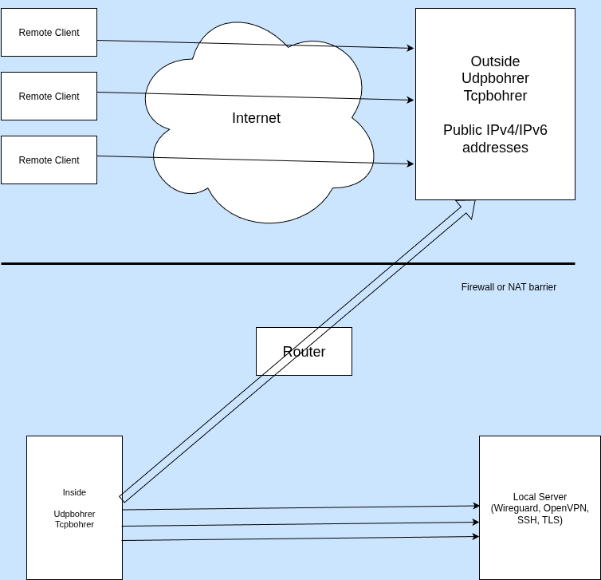
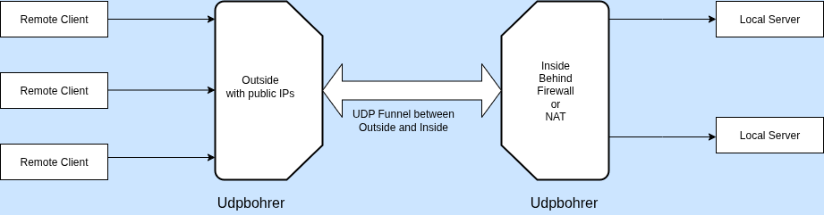
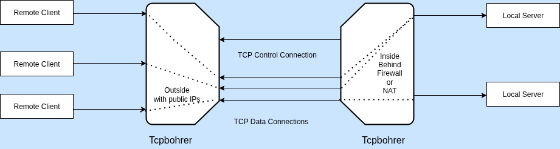

# UDPBOHRER and TCPBOHRER
The tools **udpbohrer** and **tcpbohrer** forward UDP datagrams or TCP connections across firewalls or NAT (Network Address Translation) router. One component of tcpbohrer and udpbohrer runs on the Outside and accepts connections or datagrams from Remote systems. To remote systems it acts as a server.

Udpbohrer and Tcpbohrer expect firewalls or NAT systems to forward initial tPC or UDP packets from Inside or Outside and to forward the responses back. No explicit port configuration is needed.

The Outside system must provide IPv4 and IPv6 addresses with ports that can be reached from Remote systems.

The Inside systems forwards datagrams and connections to Local systems. The Local systems are the actual servers. Hence data is exchanged between Remote systems acting as clients and Local systems acting as servers. Data exchange is always initiated from the Remote systems.

Tcpbohrer and Udpbohrer are developed in Golang and tested on Linux. They can be easily ported to other platforms. Out of Band data for TCP is not supported.

The forwarded TCP connections or UDP datagrams are neither authenticated nor encrypted. Their integrity is not checked. This is done by the forwarded protocols. Use encrypted protocols like SSH, TLS, OpenVPN or Wireguard. Do not forward legacy protocols like Telnet or FTP.

For further information take a look at the *doc/* folder and the examples *yaml* configuration files. Always use exactly the same configuration files on Inside and Outside.

Use the provided *service* files to run from systemd. These files expect the *yaml* configuration files for tcpbohrer and udpbohrer to be in */etc*. Customise them before use.

Use the watchog(8) Linux daemon to further enhance reliability.

## Use Case

## UDPBOHRER 

## TCPBOHRER

